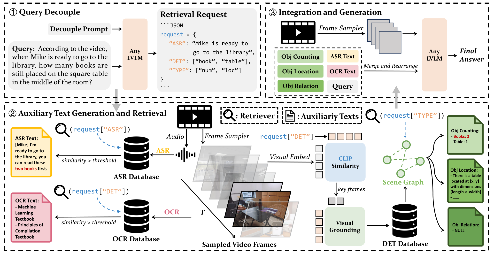
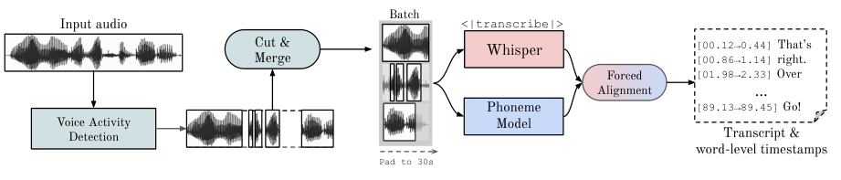
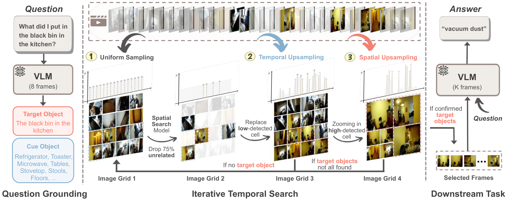
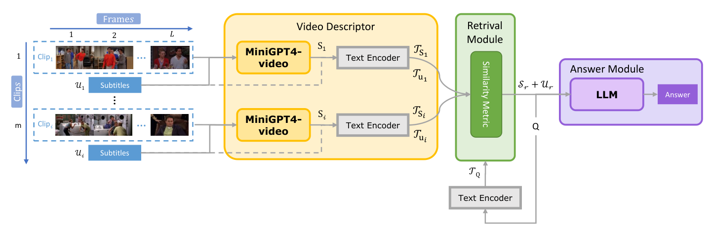
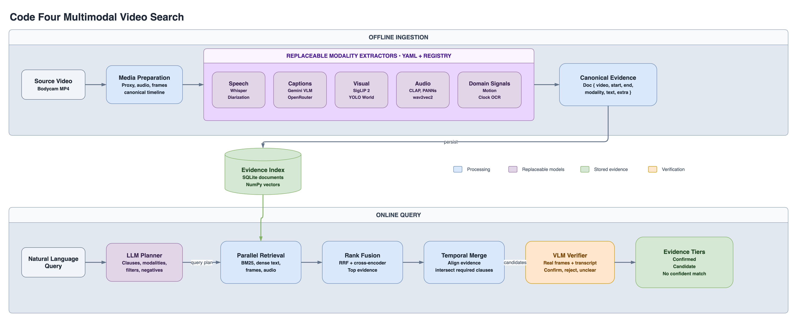

# Code Four Video Search

Natural-language search over law-enforcement body-worn camera footage.

> Docs: [design rationale](docs/design.md) · [pipeline blueprint](docs/pipeline.md) ·
> [full literature review](docs/research.md) · [build plan](docs/plan.md)

## 1. What this is

Ask questions such as *"find a vehicle stopped by police at night"* or *"find someone
raising their voice at an officer."* The system returns timestamped segments with the
transcript, visual, and audio evidence behind each result.

Results use three trust tiers:

* **Confirmed:** a VLM inspected the frames and transcript and found a match.
* **Candidate:** retrieval was strong, but verification was inconclusive.
* **No confident match:** the verifier rejected the candidates and explains why.

```text
$ uv run c4 search "officer orders the driver to step out of the vehicle"

#1  video_1  00:01:11 to 00:01:51  [CONFIRMED]
    The transcript contains two commands to step outside the vehicle.
    transcript [00:01:31] (officer) You're going to step outside the vehicle.
    transcript [00:01:41] (officer) I need you to step outside the vehicle.
```

The system is a precision funnel. Local extractors index each video once. Query-time
retrieval finds a broad set of evidence, reranking narrows it, temporal merging forms
segments, and a VLM verifies only the strongest candidates. All timestamps come from
media offsets, transcript timing, or frame positions. Models never invent absolute
times.

## 2. Quickstart

Requires **Apple Silicon**, `ffmpeg`, [`uv`](https://docs.astral.sh/uv/), and an
OpenRouter key. The local stack uses MLX, CoreML, and Apple Vision.

```bash
uv sync
echo 'OPENROUTER_API_KEY=sk-or-...' > .env

# Index videos. Completed stages are cached.
uv run c4 ingest c4-videos/video_1.mp4 c4-videos/video_2.mp4

# Search
uv run c4 search "find all interactions where an officer reads Miranda rights"

# Evaluate against the labeled query set
uv run c4 eval
```

Ingest takes about 15 to 20 minutes of local compute and $0.10 to $0.35 of captioning
per video hour. API verification costs about one to two cents per query. A slower
local Qwen2.5-VL verifier is also available through configuration.

## 3. Research foundations

The main README includes only the research that directly changed the design. See
[docs/research.md](docs/research.md) for the full review.

### 3.1 Modality extraction

Long-video models struggle to locate brief events. On the LVBench subset of
LV-Haystack, existing keyframe-selection methods reach only 2.1% temporal F1. T*
responds with question-guided temporal search
([arXiv 2504.02259](https://arxiv.org/abs/2504.02259)). VideoAgent uses 8.4 frames
on average and outperforms the 256-frame LongViViT baseline on EgoSchema
([arXiv 2403.10517](https://arxiv.org/abs/2403.10517)). Together, these results
support selective search instead of sending every frame to one model.


*Video-RAG converts ASR, OCR, and object detections into searchable text. This system
extends the same pattern to additional bodycam modalities
([arXiv 2411.13093](https://arxiv.org/abs/2411.13093)).*

Speech is a major bodycam signal, but long-form Whisper can drift, repeat, and
hallucinate phrases. The transcriber therefore uses word timestamps, decode-failure
thresholds, and a blocklist for recurring stock outputs. WhisperX informed the
timestamping and filtering design, but this implementation uses MLX Whisper rather
than the complete WhisperX pipeline.


*Reference architecture only. WhisperX combines VAD, cut-and-merge, and forced
phoneme alignment. This project does not implement that complete pipeline
([arXiv 2303.00747](https://arxiv.org/abs/2303.00747)).*

The remaining extractor choices follow four practical observations:

* **Frames:** MAD uses frame-level CLIP features, mean-pooled over candidate
  proposals, as a competitive long-form grounding baseline
  ([MAD](https://arxiv.org/abs/2112.00431)).
* **Audio:** CLAP supports text-to-audio retrieval, while PANNs supports audio tagging
  and sound-event detection. These results motivate separate audio indexes, but do
  not establish accuracy on police footage
  ([CLAP](https://arxiv.org/abs/2211.06687),
  [PANNs](https://arxiv.org/abs/1912.10211)).
* **Captions:** VLM captions make visible actions searchable when nobody names them
  ([LLoVi](https://arxiv.org/abs/2312.17235),
  [Goldfish](https://arxiv.org/abs/2407.12679)).
* **Domain signals:** diarization, clock OCR, object detection, vocal arousal, and
  camera motion add bodycam-specific evidence.

### 3.2 Semantic search

The query pipeline follows a search-then-inspect approach. Retrieval proposes a small
set of moments, then a VLM judges only those moments.


*T* grounds the question, searches through temporal and spatial upsampling, and
passes selected frames to the answering model. We borrow the separation between
search and answering, not the T* search algorithm itself
([arXiv 2504.02259](https://arxiv.org/abs/2504.02259)).*


*Goldfish retrieves relevant clips before answering over long videos. Our pipeline
adds rank fusion, reranking, temporal merging, and verification
([arXiv 2407.12679](https://arxiv.org/abs/2407.12679)).*

Three findings shape the precision stages:

* **Negation:** embedding models handle negation poorly, so negative constraints are
  checked during final verification
  ([NevIR](https://arxiv.org/abs/2305.07614),
  [NegBench](https://arxiv.org/abs/2501.09425)).
* **Attribute binding:** CLIP-like models often confuse relationships such as a red
  shirt versus a red car, so the verifier inspects real frames
  ([ARO](https://arxiv.org/abs/2210.01936)).
* **Localization:** strict top-1 localization remains difficult, so the system returns
  a ranked evidence-bearing shortlist rather than claiming one perfect answer
  ([SnAG](https://arxiv.org/abs/2404.02257)).

Video-LLMs can follow misleading prompts even when they conflict with visual evidence
([VISE](https://arxiv.org/abs/2506.07180)). The verifier therefore describes the
evidence before judging it and runs at temperature zero for repeatability. It returns
discrete tiers because VLM verbalized confidence is often miscalibrated
([CSP](https://arxiv.org/abs/2504.14848)). Conformal abstention is a future improvement
that requires a separate calibration set
([arXiv 2405.01563](https://arxiv.org/abs/2405.01563)).

## 4. Architecture

The full operational specification is in [docs/pipeline.md](docs/pipeline.md).



*Offline ingestion creates a shared evidence index. Online search retrieves and
combines evidence before a VLM verifies the strongest candidate segments.*

### 4.1 Modality extraction

Each extractor emits the same timestamped record type:

```python
Doc(
    video_id="video_13",
    t_start=565.0,
    t_end=595.0,
    modality="transcript",
    text="You have the right to remain silent...",
    extra={"speaker": "officer"},
)
```

Each modality keeps its natural time scale. A quote may last two seconds while a
sampled frame represents one instant. Evidence is aligned during search instead of
being forced into fixed chunks at ingest.

Extractors are registered through a small interface and selected in YAML. Replacing a
model does not change the `Doc` contract or downstream search code. Stage caching
also allows one extractor to rerun without repeating the whole ingest.

### 4.2 Semantic search

The planner creates up to four searchable clauses, modality hints, lexical variants,
scene filters, and negative constraints. The original query always remains a retrieval
stream, limiting the damage from a poor plan.

BM25, dense text, frame, and audio retrieval run independently. Reciprocal rank fusion
combines their ranks without comparing incompatible model scores. A cross-encoder
reranks the best documents, and temporal merging joins evidence on the shared
timeline. The verifier then judges the original user query from frames and transcript
evidence.

## 5. Rejected ideas: what's worth using vs. what's hype

| Idea | Decision | Reason |
|---|---|---|
| Send the entire video to a long-context VLM | Rejected | Long-video temporal localization remains weak and expensive |
| Supervised moment-retrieval models | Rejected | No labeled bodycam training set is available |
| Video-native embeddings as the main index | Deferred | Evidence is stronger on trimmed clips than continuous bodycam footage |
| Fixed 30-second ingest chunks | Rejected after testing | One grid loses precise quotes and forces every modality to one scale |
| Categorical emotion labels | Rejected | Real-world accuracy is weak; arousal and overt events are easier to defend |
| Negation inside embedding queries | Rejected | Bi-encoders perform poorly on negated meaning |
| Verbal VLM confidence | Rejected | Confidence statements are not reliably calibrated |
| Self-consistency for every verification | Rejected | It triples cost and can repeat the same error |
| Fully local captioning | Deferred | Much slower for a small one-time cost saving |
| ANN vector database | Deferred | NumPy search is fast enough for roughly 100,000 vectors |
| Single-frame license plate reading | Not built | Reliable ALPR requires voting across multiple sightings |
| Agentic multi-hop search | Deferred | Promising, but adds latency, cost, and complexity |

These decisions keep the system small enough for the corpus while preserving clear
upgrade paths through the extractor and search interfaces.

## 6. Evaluation

The evaluation uses the 20 shortest videos:

* 6.67 hours of footage
* About 39,500 indexed evidence records
* 24 queries
* 18 answerable queries with 72 labeled spans
* 6 no-answer traps containing real distractors

Labels were proposed by scanning transcripts and captions, then checked against frames
and transcript context. A result counts as a hit when temporal IoU is at least 0.3 or
the prediction midpoint falls inside a labeled span. Each run stores timing and API
cost in `eval/results-<timestamp>.json`.

The evaluation has two important biases. The same query set guided development, and
the system's own indexes helped discover the labels. Prosody queries are also absent
because validating them requires listening to the source audio.

### The build-up ladder: what each index bought, and what it cost

Each row is a swappable YAML configuration.

| Config | Hit@1 | Hit@5 | Correct abstentions | False abstentions | Seconds/query | Cost/query |
|---|---:|---:|---:|---:|---:|---:|
| 1. Transcripts only | 0.44 | 0.67 | 3/6 | 2 | 1.5 | $0 |
| 2. Add captions | **0.56** | **0.89** | 0/6 | 0 | 2.0 | $0 |
| 3. Add frames and objects | 0.50 | 0.67 | 0/6 | 1 | 2.3 | $0 |
| 4. Add audio, arousal, and motion | 0.50 | 0.72 | 0/6 | 1 | 2.4 | $0 |
| 5. Add VLM verification | 0.50 | 0.67 | 5/6 | 4 | 14.7 | $0.014 |
| **Recommended: captions retrieval + verification** | **0.67** | 0.83 | **6/6** | **1** | 13.2 | $0.014 |

The results support three conclusions:

1. **Captions provide the largest retrieval gain.** They find visible actions that
   transcripts miss.
2. **Frame and audio indexes add coverage but not consistent precision on this query
   set.** The label discovery process favors transcript and caption evidence.
3. **Verification improves abstention, and evidence-guided judging makes it pay for
   itself.** The recommended configuration rejects all six no-answer traps, reaches
   the best Hit@1, and leaves one false abstention - after the verifier's frame
   sample was anchored to the strongest evidence and its rules were taught that
   frames contradicting the transcript differ from frames merely missing the moment.

The metrics measure ranking and abstention, not complete segment-level precision and
recall. Extra incorrect results after the first hit are not currently penalized.

### Failure taxonomy

| Failure | Example | Next improvement |
|---|---|---|
| Verifier rejects valid evidence | A discussed event is judged as an unseen event | Transcript-aware judging rules landed (false abstentions 3 to 1); one discuss-style rejection remains |
| Scene evidence and event evidence occur at different times | Night and daylight stops | Apply scene attributes as filters |
| Correct moment ranks below the cutoff | Relevant segment appears below rank five | Improve fusion and candidate depth |
| Temporal anchor is weak | Events described as before or after another event | Restrict anchor matches to one video |

The current priority is better evaluation coverage, especially true precision and
recall, prosody queries, visual-only queries, negation, and temporal anchors.
