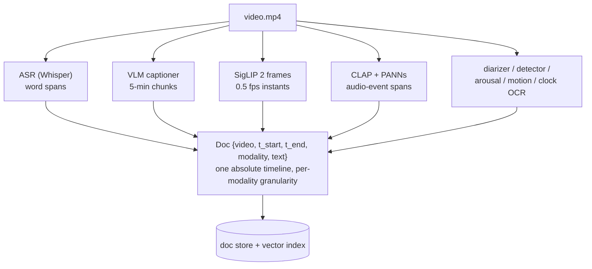
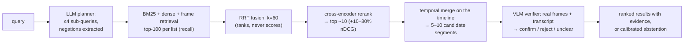
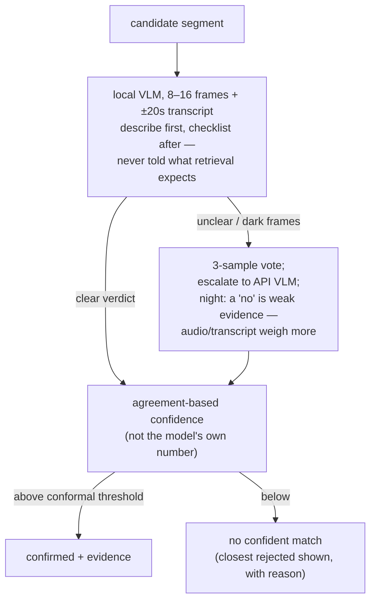

# Code Four Video Search

Natural-language search over a corpus of law-enforcement body-worn camera footage.

> Docs: [design rationale](docs/design.md) · [pipeline blueprint](docs/pipeline.md) ·
> [full literature review](docs/research.md)

## 1. What this is

Ask questions like *"find the moment a vehicle is pulled over at night"* or *"every
time someone raises their voice at an officer"* against hours of bodycam video, and get
back timestamped segments, each carrying the evidence that justifies it — transcript
quotes with word-level timing, audio-event tags, captions, frames — or an honest
*"no confident match"* when nothing qualifies.

```
$ search "officer reads Miranda rights"

#1  video_1  02:20–02:55   confirmed (agreement 3/3)
    transcript [02:31] "you have the right to remain silent…"  (speaker: officer)
    caption    [02:20–02:55] officer secures a woman beside a patrol vehicle
```

The system is built on one empirical claim: **hour-scale video search fails at finding
moments, not recognizing them.** So cheap, mostly-local indexes (speech, frames, sound,
captions, speakers, motion, on-screen clock) propose candidate moments, and a
vision-language model inspects only the finalists — real frames plus transcript — and
can say no. Timestamps always come from our own bookkeeping (ASR word times, frame
indexes, chunk offsets), never from a model's memory. Every seam is a swappable
component behind a small interface, and evaluation runs against a labeled query set
bootstrapped from the corpus itself.

Ingest costs ~15–20 min of local compute plus $0.15–0.35 of API captioning per
video-hour; a typical query costs ~$0 (verification is local, with API escalation only
for unclear verdicts).

## 2. Research foundations

The figures below are reproduced from the papers themselves (all under CC licenses
permitting reuse with attribution); our own architecture diagrams are in section 3.
The full review is in [docs/research.md](docs/research.md).

### 2.1 Modality extraction

The bottleneck evidence first: finding 1–5 needle frames among tens of thousands is
where long-video systems break — existing temporal-search methods reach just 2.1%
temporal F1 on long video (*T\*/LV-Haystack*,
[arXiv 2504.02259](https://arxiv.org/abs/2504.02259)), while question-conditioned
selection matches 256-frame dense baselines while inspecting ~8 frames (*VideoAgent*,
[arXiv 2403.10517](https://arxiv.org/abs/2403.10517)). The consequence for ingest:
spend it producing *searchable indexes*, not understanding.

The published version of that indexing pattern — extract each modality into queryable,
timestamped text and retrieve per-request:


*Video-RAG extracts ASR, OCR, and object-detection outputs into queryable text
databases, retrieves per-request, and integrates. We generalize this to nine extractors
and persist the index. Figure from Video-RAG
([arXiv 2411.13093](https://arxiv.org/abs/2411.13093), Luo et al., CC BY 4.0).*

Speech is the dominant index in this domain (*TVR*,
[arXiv 2001.09099](https://arxiv.org/abs/2001.09099); transcripts improve even the
strongest visual systems, *Deep Video Discovery*,
[arXiv 2505.18079](https://arxiv.org/abs/2505.18079)) — but raw Whisper output is a
hazard: ~1% of transcriptions contain fabricated phrases, 38% of them harmful
(*Careless Whisper*, FAccT 2024,
[arXiv 2402.08021](https://arxiv.org/abs/2402.08021)). Our transcriber adopts the
pipeline below plus the Whisper paper's own decode-failure thresholds
([arXiv 2212.04356](https://arxiv.org/abs/2212.04356) §4.5) and a stock-hallucination
blocklist ([arXiv 2501.11378](https://arxiv.org/abs/2501.11378)):


*VAD pre-segmentation, cut-and-merge, then phoneme-model forced alignment yields
word-level timestamps and suppresses hallucination on non-speech audio. Figure from
WhisperX ([arXiv 2303.00747](https://arxiv.org/abs/2303.00747), Bain et al., CC BY
4.0).*

The remaining extractor choices are each backed by a specific result:

- **Frame-level embeddings, not video-native encoders**: on untrimmed long-form video,
  zero-shot frame-level CLIP beats a trained grounding model (*MAD*,
  [arXiv 2112.00431](https://arxiv.org/abs/2112.00431)); bodycam is one continuous
  take, so there is no shot structure for video-native models to exploit.
- **Audio events as their own index**: ASR strips prosody — the text of shouting reads
  like the text of talking — so acoustic events need an audio-text model (*CLAP*,
  [arXiv 2211.06687](https://arxiv.org/abs/2211.06687)) plus a supervised AudioSet
  head for the high-stakes fixed vocabulary (*PANNs*,
  [arXiv 1912.10211](https://arxiv.org/abs/1912.10211)); conflict detection on police
  body-worn audio has direct precedent
  ([arXiv 1711.05355](https://arxiv.org/abs/1711.05355)).
- **Captions with our vocabulary**: one flash-tier VLM call per 5-minute chunk,
  prompted for the policing ontology, transcript in-prompt as a temporal anchor —
  chunk-local times are offset to absolute by arithmetic, because VLMs mislocalize
  timestamps beyond short windows (the needle-frame findings of LV-Haystack); the
  captions-as-index pattern follows *LLoVi*
  ([arXiv 2312.17235](https://arxiv.org/abs/2312.17235)) and *Goldfish*
  ([arXiv 2407.12679](https://arxiv.org/abs/2407.12679)).
- **Domain extras**: speaker roles (officer/civilian), burned-in-clock OCR (absolute
  wall time), and a camera-motion series for pursuits — motion-only activity
  recognition on real police BWV: [arXiv 1904.09062](https://arxiv.org/abs/1904.09062).

### 2.2 Semantic search

The query side follows the search-then-inspect decomposition — an explicit,
question-conditioned search stage proposes, and the answering VLM sees only confirmed
evidence:


*T\* grounds the question, searches the timeline iteratively, and hands only confirmed
frames to the answering VLM — the philosophy our query funnel adopts. Figure from T\*
([arXiv 2504.02259](https://arxiv.org/abs/2504.02259), Ye et al., CC BY-SA 4.0).*

At corpus scale, the retrieve-top-k-then-answer skeleton is what makes arbitrary video
length tractable:


*Goldfish describes fixed-time clips (captions + subtitles), retrieves top-k against
the query, and answers over only the retrieved clips. Our funnel adds rank fusion, a
cross-encoder, temporal merging, and a verification stage on top of this shape. Figure
from Goldfish ([arXiv 2407.12679](https://arxiv.org/abs/2407.12679), Ataallah et al.,
CC BY 4.0).*

Three negative results dictate where precision work happens in that funnel:

- **Negation cannot live in the embedding query** — bi-encoders rank negated pairs at
  or below random (*NevIR*, [arXiv 2305.07614](https://arxiv.org/abs/2305.07614);
  *NegBench*, [arXiv 2501.09425](https://arxiv.org/abs/2501.09425)); it is extracted by
  the planner and enforced at the cross-encoder and verifier.
- **Attribute binding fails in embeddings** — CLIP-family models are near bag-of-words
  on relations ("red *shirt*" vs red *car*; *ARO*,
  [arXiv 2210.01936](https://arxiv.org/abs/2210.01936)); binding is left to the
  verifier, which sees actual frames.
- **Strict top-1 localization is unsolved** — even fully-supervised SOTA reaches ~5%
  strict R@1 on movie-scale corpora (*SnAG* on MAD,
  [arXiv 2404.02257](https://arxiv.org/abs/2404.02257)) — so the product surface is a
  ranked, evidence-bearing shortlist scored on Hit@k, not a single oracle answer.

Verification design also traces to measured failure modes: VLMs capitulate to leading
framing (*VISE*, [arXiv 2506.07180](https://arxiv.org/abs/2506.07180)), predominantly
*miss* objects in low light rather than hallucinate them (*DarkQA*,
[arXiv 2512.24985](https://arxiv.org/abs/2512.24985)), and state near-100% confidence
in wrong answers ([arXiv 2504.14848](https://arxiv.org/abs/2504.14848)) — so our
verifier is never told what retrieval expects, treats dark-frame negatives as
"unclear", and derives confidence from sample agreement with a conformally calibrated
abstention threshold (*Conformal Abstention*,
[arXiv 2405.01563](https://arxiv.org/abs/2405.01563)).

## 3. Architecture

Our own diagrams; the full operational spec is in [docs/pipeline.md](docs/pipeline.md).

### 3.1 Modality extraction

Nine extractors run per video (all local except the captioner), each emitting one
canonical record type on the video's absolute timeline:



Each modality keeps its natural time grain — a 2-second quote stays 2 seconds, a frame
is an instant, a caption event spans what it spans. Nothing is forced into a fixed
segment grid at ingest; alignment happens at query time by merging on the shared
timeline. Stages are content-hash cached, so swapping one component re-runs only that
stage. Ingest ≈ 15–20 min local compute per video-hour, with captioning overlapping as
async API calls.

### 3.2 Semantic search

A query flows through a precision funnel — recall first, precision last, expensive
models only at the narrow end:



The verifier is tiered — local first, API only when the local model is unsure — and
its confidence comes from agreement, not self-report:



Output has three tiers — **confirmed**, **candidate (unverified)**, and **no confident
match** (with the closest rejected candidate and the verifier's reason) — because in an
evidence context a confident empty answer beats a confident wrong one.

## 4. Rejected ideas: what's worth using vs. what's hype

Things we evaluated and decided against, with the evidence that decided it.

| Idea | Verdict | Why |
|---|---|---|
| Feed the whole hour to a long-context VLM and ask "when?" | Hype (for this task) | Existing temporal search reaches 2.1% temporal F1 on long video (LV-Haystack, [2504.02259](https://arxiv.org/abs/2504.02259)); question-conditioned search inspecting ~8–32 frames matches or beats 256-frame dense sampling (VideoAgent [2403.10517](https://arxiv.org/abs/2403.10517), T\*) |
| Supervised moment-retrieval models (Moment-DETR / CG-DETR / UVCOM) | Wrong tool | Effectively supervised-only; the sole zero-shot attempt (UniVTG, [2307.16715](https://arxiv.org/abs/2307.16715)) collapses to ~11 avg mAP off-distribution — no bodycam training data exists to fix that |
| Video-native foundation embeddings (VideoPrism, InternVideo2) as the retrieval backbone | Premature | Win on trimmed-clip benchmarks; no published win on untrimmed continuous video, where frame-level CLIP is the surviving baseline (MAD, [2112.00431](https://arxiv.org/abs/2112.00431)). Kept as a per-chunk upgrade path for motion-defined queries |
| Fixed segment grid at ingest (chunk everything into 30s bins) | Rejected after building it | Bins destroy span precision (a 2-second quote becomes a 30-second answer) and force one granularity on all modalities; per-modality spans + query-time merge preserves both |
| Categorical emotion recognition ("angry", "distressed") | Hype | ~0.34 macro-F1 on real-world audio (Odyssey 2024 SER Challenge); dimensional arousal + overt CLAP events are the defensible signals |
| Handling negation in the embedding query | Broken by design | Bi-encoders rank negated pairs at or below random (NevIR [2305.07614](https://arxiv.org/abs/2305.07614); NegBench [2501.09425](https://arxiv.org/abs/2501.09425)); negation lives in the planner, cross-encoder, and verifier |
| Trusting the verifier's verbalized confidence | Miscalibrated | VLMs assert non-existent objects at near-100% stated certainty ([2504.14848](https://arxiv.org/abs/2504.14848)); we use sample agreement + a conformally calibrated threshold ([2405.01563](https://arxiv.org/abs/2405.01563)) |
| Self-consistency voting on every verification | Not worth 3x cost | Voting entrenches errors when the modal answer is wrong ([2608.11403](https://arxiv.org/abs/2608.11403)); we vote only near the decision threshold |
| Fully local VLM captioning | Bad trade | ~3x ingest wall time to save single-digit dollars; API chunk captioning also captures temporal verbs a frame captioner misses. Kept as a config swap |
| ANN vector database | Overkill | ~100k vectors: one numpy matmul per query is milliseconds; brute force + SQLite metadata wins on simplicity |
| Single-frame license-plate reads from a VLM | Unreliable | VLMs are measurably weak on non-semantic strings (OCRBench [2305.07895](https://arxiv.org/abs/2305.07895)); per-character majority voting across a plate's frames is the ALPR-standard fix (29%→69%, [1802.09567](https://arxiv.org/abs/1802.09567)) |
| Agentic multi-hop search loop (Deep Video Discovery-style) | Promising, deferred | Genuinely SOTA ([2505.18079](https://arxiv.org/abs/2505.18079)) but adds per-query LLM cost and latency; our planner keeps a bounded 2-hop form (anchor-then-restrict), and the index design is agent-ready |
