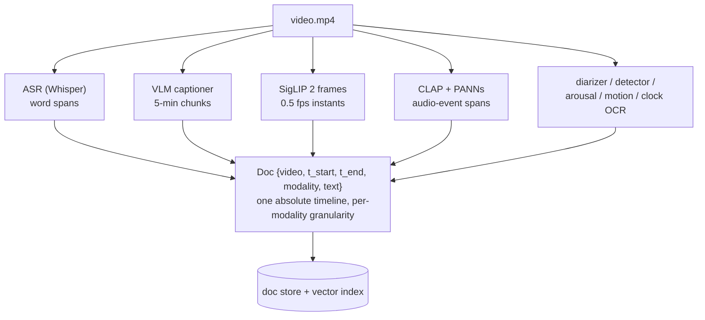
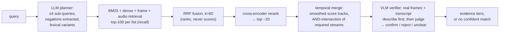

# Code Four Video Search

Natural-language search over a corpus of law-enforcement body-worn camera footage.

> Docs: [design rationale](docs/design.md) · [pipeline blueprint](docs/pipeline.md) ·
> [full literature review](docs/research.md) · [build plan](docs/plan.md)

## 1. What this is

Ask *"find the moment a vehicle is pulled over at night"* or *"every time someone
raises their voice at an officer"* against hours of bodycam video. Results come back
as timestamped segments in three trust tiers — **confirmed** (a vision-language model
inspected real frames and the transcript and agreed), **candidate** (strong retrieval,
inconclusive inspection), or **no confident match** (with the closest rejected
candidate and the verifier's stated reason). Every segment carries its evidence:
transcript quotes with word-level timing and speaker role, caption events, detections,
audio tags — and, when the burned-in overlay clock could be read, the wall-clock time.

```
$ uv run c4 search "officer orders the driver to step out of the vehicle"

#1  video_1  00:01:11-00:01:51  [CONFIRMED]  (wall clock ~22:53:06)
    verifier (escalated): The transcript explicitly contains commands for the
    driver to step outside the vehicle.
    transcript   [00:01:31] (officer) You're going to step outside the vehicle.
    transcript   [00:01:41] (officer) I need you to step outside the vehicle.
    object       [00:01:50] car, person
```

The system is built as a precision funnel: recall first, precision last, expensive
models only at the narrow end. Nine local extractors index each video once —
speech, speaker turns, frame embeddings, scene attributes, objects, audio events,
vocal arousal, camera motion, the overlay clock — plus one paid stage, a flash-tier
VLM captioning 5-minute chunks. At query time, cheap retrieval casts a wide net over
those indexes, rank fusion and a cross-encoder narrow it, temporal merging turns hits
into candidate segments, and a VLM inspects only the few finalists — where it is
allowed, and expected, to say no. Timestamps are always computed by the system (ASR
word times, frame indexes, chunk offsets); no model is ever asked to remember when
something happened.

## 2. Quickstart

Requires **Apple Silicon** (the local stack uses MLX, CoreML, and Apple Vision:
mlx-whisper, senko, ocrmac, VideoToolbox), plus `ffmpeg`, [`uv`](https://docs.astral.sh/uv/),
and an OpenRouter key for the captioner/planner/verifier API calls.

```bash
uv sync
echo 'OPENROUTER_API_KEY=sk-or-...' > .env

# Index videos (stages are cached; reruns resume where they stopped)
uv run c4 ingest c4-videos/video_1.mp4 c4-videos/video_2.mp4

# Search
uv run c4 search "find all interactions where an officer reads Miranda rights"
uv run c4 search "person in a red shirt" --no-verify   # raw retrieval, no VLM pass

# Score against the labeled query set
uv run c4 eval
```

Ingest costs ~15–20 min of local compute plus $0.10–0.35 of API captioning per
video-hour. A query costs a few cents when API verification is enabled (the default
config), or ~$0 with the local verifier (`verifier.use_local: true` — slower,
Qwen2.5-VL on-device).

## 3. Research foundations

The figures below are reproduced from the papers themselves (all under CC licenses
permitting reuse with attribution); our own architecture diagrams are in section 4.
The full review is in [docs/research.md](docs/research.md).

### 3.1 Modality extraction

The bottleneck evidence first: finding 1–5 needle frames among tens of thousands is
where long-video systems break — existing temporal-search methods reach just 2.1%
temporal F1 on long video (*T\*/LV-Haystack*,
[arXiv 2504.02259](https://arxiv.org/abs/2504.02259)), while question-conditioned
selection matches 256-frame dense baselines while inspecting ~8 frames (*VideoAgent*,
[arXiv 2403.10517](https://arxiv.org/abs/2403.10517)). The consequence for ingest:
spend it producing *searchable indexes*, not understanding.

The published version of that indexing pattern — extract each modality into queryable,
timestamped text and retrieve per-request:


*Video-RAG extracts ASR, OCR, and object-detection outputs into queryable text
databases, retrieves per-request, and integrates. We generalize this to nine extractors
and persist the index. Figure from Video-RAG
([arXiv 2411.13093](https://arxiv.org/abs/2411.13093), Luo et al., CC BY 4.0).*

Speech carries the dominant signal in this domain (*TVR*,
[arXiv 2001.09099](https://arxiv.org/abs/2001.09099); transcripts improve even the
strongest visual systems, *Deep Video Discovery*,
[arXiv 2505.18079](https://arxiv.org/abs/2505.18079)) — but raw Whisper output is a
hazard: ~1% of transcriptions contain fabricated phrases, 38% of them harmful
(*Careless Whisper*, FAccT 2024,
[arXiv 2402.08021](https://arxiv.org/abs/2402.08021)), and a fabricated sentence that
happens to match a query becomes false evidence. Our transcriber adopts the pipeline
below plus the Whisper paper's own decode-failure thresholds
([arXiv 2212.04356](https://arxiv.org/abs/2212.04356) §4.5) and a blocklist of
Whisper's recurring stock outputs ([arXiv 2501.11378](https://arxiv.org/abs/2501.11378)):


*VAD pre-segmentation, cut-and-merge, then phoneme-model forced alignment yields
word-level timestamps and suppresses hallucination on non-speech audio. Figure from
WhisperX ([arXiv 2303.00747](https://arxiv.org/abs/2303.00747), Bain et al., CC BY
4.0).*

The remaining extractor choices are each backed by a specific result:

- **Frame-level embeddings, not video-native encoders**: on untrimmed long-form video,
  zero-shot frame-level CLIP beats a trained grounding model (*MAD*,
  [arXiv 2112.00431](https://arxiv.org/abs/2112.00431)); bodycam is one continuous
  take, so there is no shot structure for video-native models to exploit.
- **Audio events as their own index**: a transcript renders shouting and calm speech
  as the same words, so acoustic events need an audio-text model (*CLAP*,
  [arXiv 2211.06687](https://arxiv.org/abs/2211.06687)) plus a supervised AudioSet
  head for the high-stakes fixed vocabulary (*PANNs*,
  [arXiv 1912.10211](https://arxiv.org/abs/1912.10211)); conflict detection on police
  body-worn audio has direct precedent
  ([arXiv 1711.05355](https://arxiv.org/abs/1711.05355)).
- **Captions dictate the search vocabulary**: one flash-tier VLM call per 5-minute
  chunk, prompted with a policing ontology, so "handcuffing" is findable even when no
  one says the word. Chunk-local event times are offset to absolute by arithmetic —
  the model is never trusted with absolute time (the needle-frame findings of
  LV-Haystack). The captions-as-index pattern follows *LLoVi*
  ([arXiv 2312.17235](https://arxiv.org/abs/2312.17235)) and *Goldfish*
  ([arXiv 2407.12679](https://arxiv.org/abs/2407.12679)).
- **Domain extras**: diarized speaker turns with an officer/other mic-proximity
  heuristic, burned-in-clock OCR with a monotonicity filter (absolute wall time in
  results), and a camera-motion series for pursuits — motion-only activity
  recognition on real police BWV: [arXiv 1904.09062](https://arxiv.org/abs/1904.09062).

### 3.2 Semantic search

The query side follows the search-then-inspect decomposition — an explicit,
question-conditioned search stage proposes, and the answering VLM sees only the
finalists:


*T\* grounds the question, searches the timeline iteratively, and hands only confirmed
frames to the answering VLM — the philosophy our query funnel adopts. Figure from T\*
([arXiv 2504.02259](https://arxiv.org/abs/2504.02259), Ye et al., CC BY-SA 4.0).*

At corpus scale, the retrieve-top-k-then-answer skeleton is what makes arbitrary video
length tractable:


*Goldfish describes fixed-time clips (captions + subtitles), retrieves top-k against
the query, and answers over only the retrieved clips. Our funnel adds rank fusion, a
cross-encoder, temporal merging, and a verification stage on top of this shape. Figure
from Goldfish ([arXiv 2407.12679](https://arxiv.org/abs/2407.12679), Ataallah et al.,
CC BY 4.0).*

Three negative results dictate where precision work happens in that funnel:

- **Negation cannot live in the embedding query** — bi-encoders rank negated pairs at
  or below random (*NevIR*, [arXiv 2305.07614](https://arxiv.org/abs/2305.07614);
  *NegBench*, [arXiv 2501.09425](https://arxiv.org/abs/2501.09425)). The planner
  extracts negations and they are enforced only at stages that read whole passages:
  the cross-encoder (the one retrieval architecture above random on NevIR) and the
  verifier.
- **Attribute binding fails in embeddings** — CLIP-family models are near bag-of-words
  on relations ("red *shirt*" vs red *car*; *ARO*,
  [arXiv 2210.01936](https://arxiv.org/abs/2210.01936)); binding is left to the
  verifier, which sees actual frames.
- **Strict top-1 localization is unsolved** — even fully-supervised SOTA reaches ~5%
  strict R@1 on movie-scale corpora (*SnAG* on MAD,
  [arXiv 2404.02257](https://arxiv.org/abs/2404.02257)) — so the product surface is a
  ranked, evidence-bearing shortlist scored on Hit@k, not a single oracle answer.

Verification design also traces to measured failure modes: VLMs capitulate to leading
framing (*VISE*, [arXiv 2506.07180](https://arxiv.org/abs/2506.07180)), and in low
light they predominantly *miss* objects that are present rather than invent absent
ones (*DarkQA*, [arXiv 2512.24985](https://arxiv.org/abs/2512.24985)). So the verifier
describes the frames before judging, is never told what retrieval expects to find, and
treats a visibility-limited "no" on night footage as "unclear" rather than a
rejection. Verdicts run at temperature 0 for repeatability. Verbalized model
confidence is documented as miscalibrated
([arXiv 2504.14848](https://arxiv.org/abs/2504.14848)) — which is why the output is
discrete evidence tiers rather than a probability; sample-agreement confidence with a
conformally calibrated abstention threshold
([arXiv 2405.01563](https://arxiv.org/abs/2405.01563)) is the designed upgrade once
the labeled set is large enough to calibrate on, and is **not yet implemented**.

## 4. Architecture

Our own diagrams; the full operational spec is in [docs/pipeline.md](docs/pipeline.md).

### 4.1 Modality extraction

Nine local extractors plus the paid captioner run per video, each emitting one
canonical record type on the video's absolute timeline:



Each modality keeps its natural time grain — a 2-second quote stays 2 seconds, a frame
is an instant, a caption event spans what it spans. Nothing is forced into a fixed
segment grid at ingest (we built the fixed-grid version first and rejected it — see
§5); alignment happens at query time by merging on the shared timeline. Stages are
content-hash cached against their config, so changing one component's settings —
say, the detector's vocabulary — re-runs only that stage.

### 4.2 Semantic search



Planner rules with teeth: negations never reach a retriever; attribute constraints
("at night") become filters over scene docs rather than searches; event-anchored
ordering ("after the arrest") grounds the anchor first and restricts the interval; the
planner also emits lexical variants that bridge query vocabulary to spoken vocabulary
("breathalyzer result" → "point two four"). The unmodified query is always one of the
retrieval streams, which bounds the planner's downside at zero. Verification judges
the **user's original query**, not the planner's retrieval phrasings — "orders the
driver to step out" is satisfied by the spoken order even when no exit is visible.

Verifier tiers are one config line: API-first by default (seconds per candidate, a few
cents per query), or local Qwen2.5-VL (`use_local: true`, ~$0 but minutes per query),
with unclear local verdicts escalating to the API. Output has three tiers —
**confirmed**, **candidate (unverified)**, **no confident match** (with the closest
rejected candidate and the verifier's reason) — because in evidence review, returning
nothing with reasons beats returning something wrong.

## 5. Rejected ideas: what's worth using vs. what's hype

Things we evaluated and decided against, with the evidence that decided it.

| Idea | Verdict | Why |
|---|---|---|
| Feed the whole hour to a long-context VLM and ask "when?" | Hype (for this task) | Existing temporal search reaches 2.1% temporal F1 on long video (LV-Haystack, [2504.02259](https://arxiv.org/abs/2504.02259)); question-conditioned search inspecting ~8–32 frames matches or beats 256-frame dense sampling (VideoAgent [2403.10517](https://arxiv.org/abs/2403.10517), T\*) |
| Supervised moment-retrieval models (Moment-DETR / CG-DETR / UVCOM) | Wrong tool | Effectively supervised-only; the sole zero-shot attempt (UniVTG, [2307.16715](https://arxiv.org/abs/2307.16715)) collapses to ~11 avg mAP off-distribution — no bodycam training data exists to fix that |
| Video-native foundation embeddings (VideoPrism, InternVideo2) as the retrieval backbone | Premature | Win on trimmed-clip benchmarks; no published win on untrimmed continuous video, where frame-level CLIP is the surviving baseline (MAD, [2112.00431](https://arxiv.org/abs/2112.00431)). Kept as a per-chunk upgrade path for motion-defined queries |
| Fixed segment grid at ingest (chunk everything into 30s bins) | Rejected after building it | Bins destroy span precision (a 2-second quote becomes a 30-second answer) and force one granularity on all modalities; per-modality spans + query-time merge preserves both. The grid version is in this repo's git history |
| Categorical emotion recognition ("angry", "distressed") | Hype | ~0.34 macro-F1 on real-world audio (Odyssey 2024 SER Challenge); dimensional arousal + overt CLAP events are the defensible signals |
| Handling negation in the embedding query | Broken by design | Bi-encoders rank negated pairs at or below random (NevIR [2305.07614](https://arxiv.org/abs/2305.07614); NegBench [2501.09425](https://arxiv.org/abs/2501.09425)); negation lives in the planner, cross-encoder, and verifier |
| Trusting the verifier's verbalized confidence | Miscalibrated | VLMs assert non-existent objects at near-100% stated certainty ([2504.14848](https://arxiv.org/abs/2504.14848)); we output discrete evidence tiers instead, with conformal calibration ([2405.01563](https://arxiv.org/abs/2405.01563)) as the documented upgrade |
| Self-consistency voting on every verification | Not worth 3x cost | Voting entrenches errors when the modal answer is wrong ([2608.11403](https://arxiv.org/abs/2608.11403)); we run single deterministic verdicts and spend the saved budget on escalating unclear cases to a stronger model |
| Fully local VLM captioning | Bad trade | ~3x ingest wall time to save single-digit dollars; API chunk captioning also captures temporal verbs a frame captioner misses. Kept as a config swap |
| ANN vector database | Overkill | At ~100k vectors, exhaustive numpy similarity answers in milliseconds; an index would add moving parts without a measurable win at this corpus size |
| Single-frame license-plate reads from a VLM | Unreliable — and plate reading is **not built** | VLMs are measurably weak on non-semantic strings (OCRBench [2305.07895](https://arxiv.org/abs/2305.07895)). The ALPR literature's fix is per-character voting across a plate's sightings (29%→69%, [1802.09567](https://arxiv.org/abs/1802.09567)); that design is documented but not implemented here — plate queries currently surface segments via captions/detections without reading characters |
| Agentic multi-hop search loop (Deep Video Discovery-style) | Promising, deferred | Genuinely SOTA ([2505.18079](https://arxiv.org/abs/2505.18079)) but adds per-query LLM cost and latency; our planner keeps a bounded anchor-then-restrict form, and the index design is agent-ready |

## 6. Evaluation

**Corpus**: the 20 shortest videos — 6.67 hours, ~39,500 indexed docs. Ingest measured
at ~12 min of local compute per video-hour and **$0.90 of captioning for the entire
corpus**. **Query set**: 24 queries — 18 answerable (58 truth spans) and 6 no-answer
traps seeded with real corpus distractors ("I'm glad it *wasn't* shots fired", pet
dogs at a fire scene for the K-9 trap, medics everywhere but no CPR). Truth spans were
proposed by scanning every transcript and caption, then audited by frame extraction
and transcript review with speaker roles; every rejected candidate is documented in
[eval/queries.yaml](eval/queries.yaml) — cuffs being *removed*, after-the-fact
retellings of a pursuit, a driver named Chase matching the pursuit pattern, and two
caption-proposed spans whose frame checks showed terrain and a dashcam gate instead of
the event. A hit = tIoU >= 0.3 or prediction midpoint inside truth. Every run logs
per-stage wall time and API cost to `eval/results-<timestamp>.json`.

Two labels **changed when the corpus grew** from 10 to 20 videos — the exact hazard
the literature warns about, caught by re-verification: Miranda readings now exist
(previously a valid no-answer trap), and full field sobriety tests are now conducted
(the query had been narrowed to "asks about" when none were). Stated caveats: the
eval set doubled as the development set; label discovery through our own
transcripts/captions is biased toward queries those indexes can answer; prosody
queries are absent because auditing them requires listening.

### The build-up ladder: what each index bought, and what it cost

Each row is one config file — swapping a rung is a `-c` flag, which is the
hotswappability demo running for real.

*Reading the columns: **abstention** is the standard selective-prediction term for
correctly answering "no confident match" - the Abstention column counts the six trap
queries (events that don't exist in the footage) the config correctly refused, and
**false abstains** counts real-answer queries it wrongly refused.*

| Config | hit@1 | hit@5 | Abstention | False abstains | s/query | $/query |
|---|---|---|---|---|---|---|
| 1. transcripts only | 0.39 | 0.61 | 3/6 | 2 | 2.3 | ~0 |
| 2. + captions | 0.44 | **0.78** | 0/6 | 0 | 1.9 | ~0 |
| 3. + frames/objects | 0.44 | 0.61 | 0/6 | 1 | 2.1 | ~0 |
| 4. + audio/arousal/motion | 0.44 | 0.67 | 0/6 | 1 | 2.3 | ~0 |
| 5. + VLM verification (all indexes) | 0.44 | 0.56 | 5/6 | 4 | 14.9 | $0.014 |
| **recommended** (captions retrieval + verify) | **0.50** | 0.67 | **6/6** | 3 | 12.8 | $0.014 |

What the table says:

1. **Captions are the highest-value index.** They lift hit@5 from 0.61 to 0.78 and
   rescue queries transcripts cannot carry ("a person is being handcuffed", the foot
   pursuit) — for $0.90 of one-time cost across 6.7 hours.
2. **Frame and audio retrieval are roughly neutral on this query set** — they add a
   little hit@5 noise-vs-recall churn but no net precision. The label-bootstrap bias
   is the honest caveat (no query here *requires* frame-only evidence), so
   [default.yaml](configs/default.yaml) keeps them for open-vocabulary visual
   queries; the [recommended config](configs/recommended.yaml) turns them off for
   this workload and says why.
3. **Verification buys abstention.** Every unverified config answers the six trap
   queries with confident nonsense (0/6); the recommended config refuses all six
   correctly — and reaches the best hit@1 — at ~13s and 1.4 cents per query. Its
   price is three false abstains on hard answerable queries. In an evidence-review
   setting we take that trade, and the table lets a reader take the other side.
4. **The eval corrected itself twice.** It caught the labels being wrong in the
   system's favor once (an unlabeled second vehicle fire the system outranked), and
   the corpus expansion flipped two labels (Miranda, sobriety) that re-verification
   caught. An eval that never catches its own labels is not being run hard enough.

### Failure taxonomy (recommended config, answerable-query misses)

| Class | Count | Example |
|---|---|---|
| Verifier over-strictness — uniform frame sampling misses the event core in a long span, or a mention-based truth is judged as an unseen event | 3 | vehicle-fire and crash-scene rejected despite correct retrieval; "officers *discuss*" judged visually |
| Scene-attribute queries — "at night"/"in daylight" truths sit at video starts; candidates form where evidence mass is, outside tIoU | 2 | night stop, daylight stop |
| Rank depth — correct video found, right span below rank 5 or beside truth | 4 | medics @3; back-of-car @2; jail threat @2 |

The obvious next fixes, deliberately not rushed in before submission: guarantee the
evidence-peak frame in the verifier's sample (currently uniform), let mention-style
queries accept transcript-only verification, and treat scene-attribute queries as
filter-first searches rather than similarity searches.
